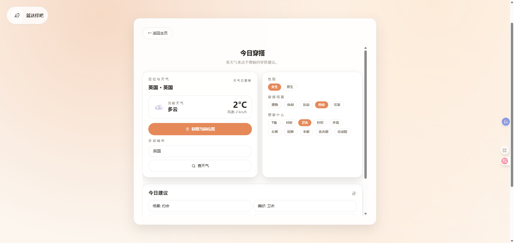

# Just-Like-This

一个极简主义、带冷幽默的日常决策与解压工具集。以便当盒（Bento Grid）布局组织功能卡片，支持三主题与中英切换，强调三步以内到达结果的轻交互。

## 功能模块

- 晚饭决策姬：随机抽选菜单，缓解选择焦虑
- 买不买决策器：给出裁决与理由，提供“心理借口”
- 赛博木鱼：敲一下积攒功德，快速解压
- 完美摸鱼借口：生成荒诞但自洽的摸鱼理由
- 今日人设：随机赋予今日标签
- 敬请期待：预留扩展位

## 技术栈

- React (Hooks)
- Tailwind CSS
- Lucide-React
- Vite

## 启动方式

```bash
npm install
npm run dev
```

## 目录结构

```
.
├── index.html
├── package.json
├── postcss.config.js
├── tailwind.config.js
├── vite.config.js
├── src
│   ├── App.jsx
│   ├── index.css
│   └── main.jsx
└── README.md
```

## 截图





> 在赶工...

